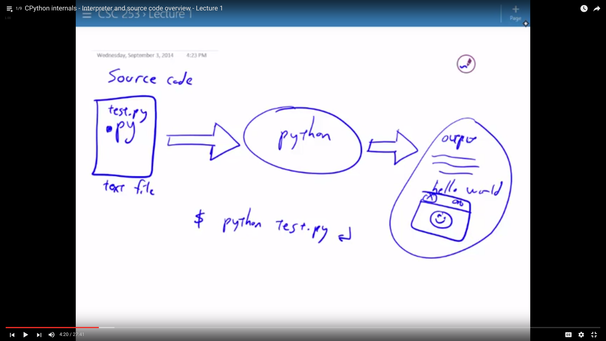
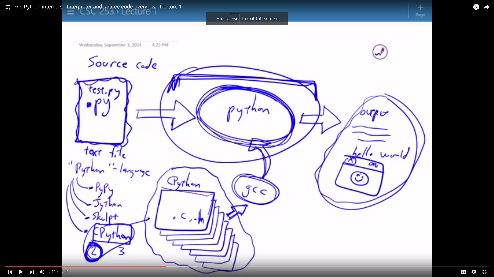
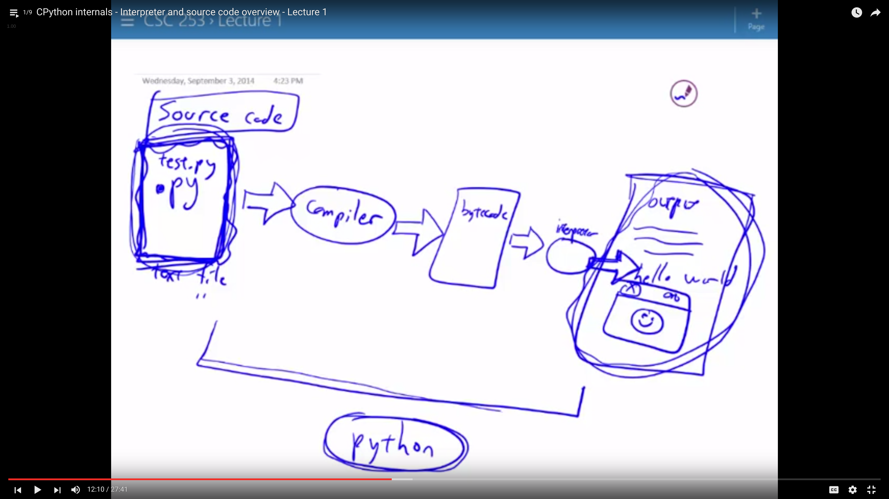

# Day 1 - Setup Environment, Shell, Basic Programming, First Exercise
## Setup Environment
pyreadline
1. [Atom](https://github.com/selassid/codeguild/blob/master/notes/atom.md) and [Tricks](https://github.com/selassid/codeguild/blob/master/notes/atom-python.md)
2. [Python](https://github.com/selassid/codeguild/blob/master/notes/py.md)

## Shell
A shell is another way for you to interact with your computer. This is often a CLI (Command Line Interface) as apposed to a GUI (Graphical User Interface). Developers often favor CLI due to the ease of automating repetitive tasks. We will to look at [Powershell/Bash](https://github.com/selassid/codeguild/blob/master/notes/cli.md) and how it compares to your GUI.

[Learn Python the Hard Way - Appendix A](http://learnpythonthehardway.org/book/appendixa.html)

## Python
In this course we are introducing you to python. Our first exercise will show you how to make a python file, establish a workflow, understand variables and introduce some programming vocabulary.








I suggest having `ipython shell` and your `atom editor` both open in your workspace, until you develop your own work flow. Those with mac or linux can install use `bpython shell` if they prefer.

### disabling magic in your ipython environment
```
$ ipython3
Python 3.4.2 (default, Jul  9 2015, 17:24:30)
Type "copyright", "credits" or "license" for more information.

IPython 4.1.2 -- An enhanced Interactive Python.
?         -> Introduction and overview of IPython's features.
%quickref -> Quick reference.
help      -> Python's own help system.
object?   -> Details about 'object', use 'object??' for extra details.

In [1]: ip = get_ipython()

In [2]: ip.Completer.matchers.remove(ip.Completer.magic_matches)

In [3]:
```

### Variables and Using Strings
```python
#!/usr/bin/env python

# assignment
x = 'cat'
print(x)

# reasignment
x = 'dog'
print(x)

x = 'cat'
x = 'dog'
print(x)

# multiple variables
y = 'cat'
print(x, y)

# pattern matched assignment
b, a = 'neat!', 'thats'
print(a, b)

# What do you think this does?
x, y = y, x
print(x, y)
```

### print()
1. The `print()` function allows us to write content to the `console`, also called a `terminal` or `CLI`.
2. You may find **reputable** resources with examples online that just don't work. Most people's first experience with this is in python's print. Programming languages have release `versions` that may have different, often competing, `syntax`. This, [Python 2.7 vs Python 3.x](https://www.webucator.com/blog/2016/03/still-using-python-2-it-is-time-to-upgrade/), article can help you drink the Python 3.x Kool Aid.
```python
#!/usr/bin/env python3

print("THIS IS HOW YOU PRINT IN PYTHON 3.x")
```
```python
#!/usr/bin/env python2.7

print "THIS IS HOW YOU PRINT IN PYTHON 2.x"
```
### String concatenation and format() method
```python
#!/usr/bin/env python

def pause():
    # pause program until user input
    _ = input()


x = 'elephant'
y = 'pig'

# string concatination
print(x, y)
print(x + y)
print(x*3 + y*2)

z = x + y
print(z)

z = x + ' loves ' + y
print(z)

# use of .format method
z = '{} loves {}!'
print(z.format(x, y))
print(z.format(y, x))

print(z.format('philip', 'hats'))

print(str.format(z, 'student', 'learning'))
print(str.format(z, 'raver',   'dancing'))

```

```python
#!/usr/bin/env python
# what is a panagram?
story_tamplate = 'The exodus of {adjective_one} {noun_one}s is craved by {adjective_one} {noun_two}s.'
print(story_template)

print(story_template.format(adjective_one='jazzy', noun_one='pidgeon', adjective_two='squeamish', noun_two='walker'))
print(story_template.format(adjective_one='funky', noun_one='wizard', adjective_two='spanish', noun_two='camel'))

# can we split this up?
my_story = story_template.format(
    adjective_one='lusting',
    noun_one='lion',
    adjective_two='lackadaisical',
    noun_two='lemur',
    )
print(s)

# can we check if something is a panagram?
print('a', str.count(my_story, 'a'))
print('b', str.count(my_story, 'b'))
print('c', str.count(my_story, 'c'))
print('d', str.count(my_story, 'd'))
print('e', str.count(my_story, 'e'))
print('f', str.count(my_story, 'f'))
print('g', str.count(my_story, 'g'))

print('h', my_story.count('h'))
print('i', my_story.count('i'))
print('j', my_story.count('j'))
print('k', my_story.count('k'))
print('l', my_story.count('l'))
print('m', my_story.count('m'))
...
print('x', my_story.count('x'))
print('y', my_story.count('y'))
print('z', my_story.count('z'))
```

### Input()

```python
x = input()
print(x)

message = input()
print(message, x)

x = input()
print(x, message, x)

print('Please Input Text :', end='')
text = input()
print(text, 'Was Input!')

text = input('perhaps a cleaner input:')
print(text)
```

### Have the students make a [Madlib](./example-files/madlib.py)

```python
#!/usr/bin/env python

x = input("Into variable 'x' i will save the value :")
print("into x I saved the value {x}!".format(x=x))

x = input('again :')
print("into x I saved the value {x}!".format(x=x))

y = input('what about something else?')
print(y, 'has been saved into a variable in my program.')

print('again :')
y = input()
print(y, 'has been saved into a variable in my program.')
```
