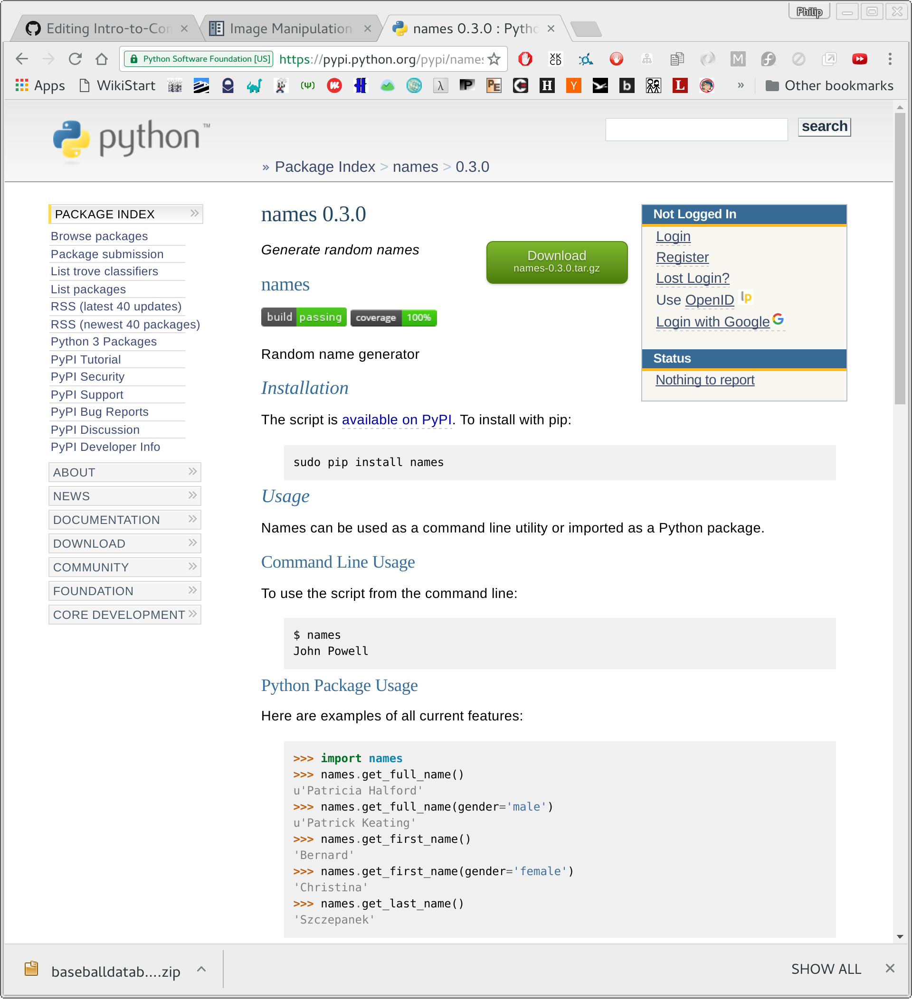

# Boot Camp
http://pdxcodeguild.com/
* Full Stack
* Front End

# More on Modules
We firts identify a tast, then we search for a package that provides that facility. In this instance, we are in needs of random names of people for our *Simplified Blackjack*.

### Finding a Module
For today's class, I needed a way to generate names of game players. Lets see if someone else has done it!

```
https://pypi.python.org/pypi
```




### Audit the code
Although it isn't common practice for small projects, industry projects often have an auditing process. This is a small enough module for us to audit during class. 

### Installing **names**
Please do not use `sudo`. It is dangerous to install packages with the `sudo` command on your system.

```
$ pip install --user names
```

# Review on whiteboard the current content

We will review the material at a high level, and write the operations we have explored thus far. Open for questions.

# Blackjack template

Modifications to rules

1. Ace = 1
2. Closest to 21, while less wins
3. No need to hide cards
4. Dealer doesn't player

```python
#!/usr/bin/env python                                                                                    

from collections import namedtuple
from random      import shuffle
from itertools   import cycle
from names       import get_full_name

"""                                                                                                      
The goal of this assignment is to have you define your own game rules                                    
"""

def new_deck():
    Card = namedtuple('Card', ['suit', 'face'])

    deck = []
    for suit in ['H', 'C', 'S', 'D']:
        for face in ['2', '3', '4', '5', '6', '7', '8', '9', '10', 'J', 'Q', 'K', 'A']:
            new_card = Card(suit=suit, face=face)
            deck.append(new_card)
    shuffle(deck)
    return deck


... # define each logical step as a function stub ie

def main():
    num_of_players = 3

    deck = new_deck()
    for _ in range(num_of_players):
        name = get_full_name()
        hand = []
        deck[name] = hand
        ... # need to draw two cards per player from deck

    for index, name in enumerate(cycle(players.keys())):
        print('{} : takes turn {}'.format(name, index))
        print('    {}'.format(players[name]))
        task = input('what would you like to do? ')
        ...

        print(' \n\n --- ')


if __name__ == '__main__':
    main()
```

